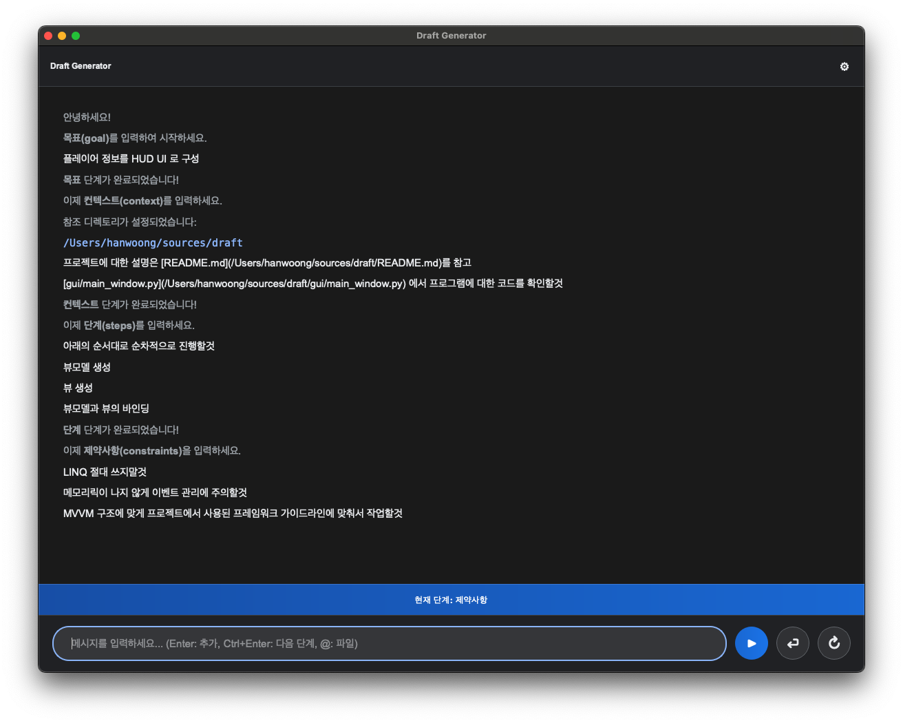

# Draft Generator

AICP 프롬프트 엔지니어링을 위한 `*.draft` 파일 생성 도구입니다.

## 개요

Draft Generator는 프로메테우스 프레임워크의 AICP(AI Code Prompt) 워크플로우에서 사용되는 `*.draft` 파일을 쉽게 작성할 수 있도록 돕는 PyQt6 기반 데스크톱 애플리케이션입니다.

대화형 인터페이스를 통해 한글로 초안을 작성하면, 자동으로 영어로 번역하여 `*.aispec` 파일 생성을 위한 구조화된 YAML 파일을 출력합니다.

## 역할

이 도구는 AICP 워크플로우에서 다음 역할을 수행합니다:

1. **구조화된 초안 작성**: 목표(goal), 컨텍스트(context), 단계(steps), 제약사항(constraints) 4단계로 나누어 초안 작성
2. **한영 자동 번역**: 작성된 한글 내용을 영어로 번역
3. **YAML 출력**: `*.draft` 형식으로 구조화된 파일 생성
4. **다음 단계 연계**: 생성된 `*.draft` 파일은 @PrompterAgent에 전달되어 최종 `*.aispec` 파일로 변환됩니다

## 주요 기능

- **4단계 워크플로우**: goal → context → steps → constraints 순서로 체계적인 작성
- **파일 참조**: `@` 기호로 프로젝트 파일 자동완성 및 참조
- **자동 번역**: Google Translate 기반 한영 번역
- **YAML 출력**: 표준화된 `*.draft` 형식 생성

## 설치 방법

### 사전 요구사항

- Python 3.8 이상
- pip 패키지 매니저

### 설치

1. 저장소 클론:
```bash
git clone <repository-url>
cd draft
```

2. 의존성 설치:
```bash
pip install -r requirements.txt
```

### 의존성 패키지

- **PyQt6** (≥6.10.0): GUI 프레임워크
- **PyYAML** (≥6.0.3): YAML 파일 처리
- **deep-translator** (≥1.11.4): 번역 서비스

## 사용 방법

### 애플리케이션 실행

메인 애플리케이션 실행:
```bash
python main.py
```

### 초안 작성하기

1. **참조 디렉토리 설정** (선택사항): 툴바의 설정 아이콘(⚙)에서 프로젝트 루트 디렉토리 지정

2. **4단계 워크플로우 진행**:
   - **목표 (Goal)**: 작업의 최종 목표 입력 → 자동으로 다음 단계 진행
   - **컨텍스트 (Context)**: 필요한 배경 정보나 참조 파일 추가
   - **단계 (Steps)**: 실행할 작업 순서 정의
   - **제약사항 (Constraints)**: 반드시 지켜야 할 규칙 명시

3. **키보드 단축키**:
   - `Enter`: 항목 추가
   - `Ctrl+Enter`: 다음 단계로 이동
   - `@파일명`: 파일 참조 자동완성

4. **완료**: 모든 단계 완료 시 자동으로 영어로 번역하고 `.draft` 파일로 저장

### 사용 예시

애플리케이션 실행 화면:



위 화면에서 작성한 내용의 결과물 ([examples/example.draft](examples/example.draft)):
```yaml
goal: Organize player information into HUD UI

context:
- For a description of the project, see [README.md](/Users/hanwoong/sources/draft/README.md)
- Check the code for the program in [gui/main_window.py](/Users/hanwoong/sources/draft/gui/main_window.py)

steps:
- Proceed sequentially in the following order:
- Create view model
- Create view
- Binding of view model and view

constraints:
- Never use LINQ
- Be careful with event management to avoid memory leaks.
- Work in accordance with the framework guidelines used in the project in accordance with the MVVM structure.
```

### 출력 형식

표준 `*.draft` 파일 구조:
```yaml
goal: "Create player profile popup"

context:
  - "Must inherit from base popup class"
  - "Use PlayerAPI for player data"

steps:
  - "Create ViewModel first"
  - "Then create View"
  - "Bind ViewModel and View components"

constraints:
  - "Never use LINQ"
  - "Properly unsubscribe events to prevent memory leaks"
```

이 파일은 @PrompterAgent에 전달되어 최종 `*.aispec` 파일로 변환됩니다.

## 프로젝트 구조

```
draft/
├── main.py                 # 애플리케이션 진입점
├── gui/
│   ├── main_window.py     # 메인 윈도우 및 설정
│   └── chat_widget.py     # 대화형 인터페이스
├── logic/
│   └── file_scanner.py    # 파일 스캔 유틸리티
├── translator/
│   └── translator.py      # 한영 번역
├── examples/
│   └── example.draft      # 사용 예시 파일
├── images/
│   └── screenshot.png     # 애플리케이션 스크린샷
├── requirements.txt       # 의존성
└── README.md              # 이 문서
```

## 설정

`config.json` 파일에 참조 디렉토리가 자동 저장됩니다:
```json
{
  "root_dir": "/프로젝트/경로"
}
```

## 문제 해결

- **번역 오류**: 인터넷 연결 확인 또는 Google Translate 서비스 상태 확인
- **파일 참조 오류**: 설정에서 올바른 참조 디렉토리가 지정되었는지 확인
